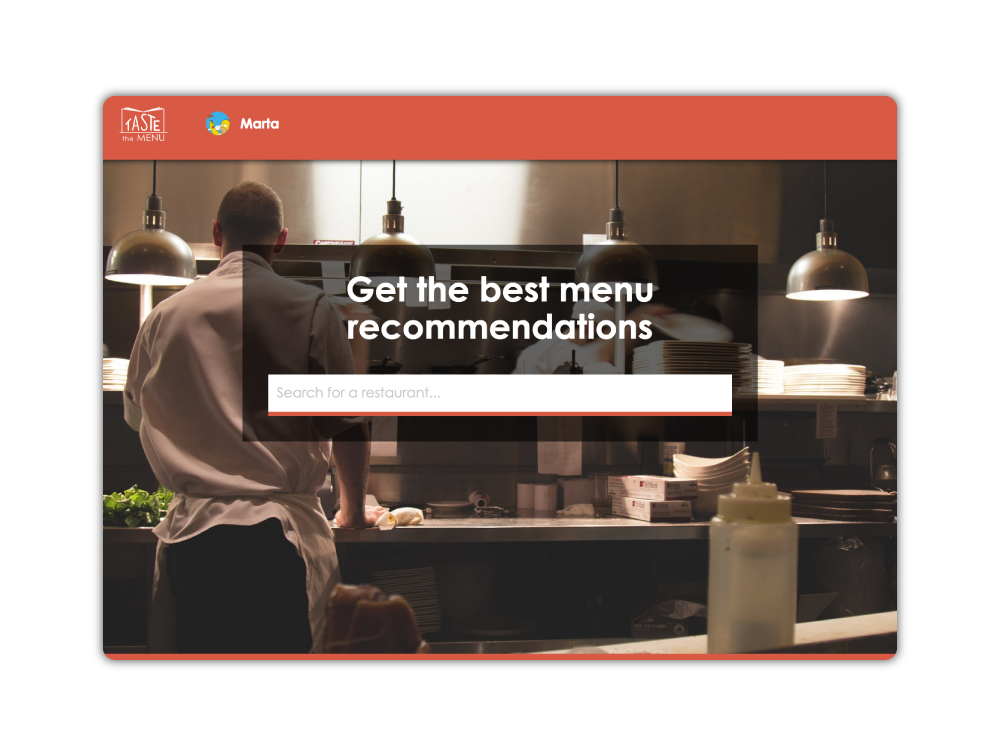
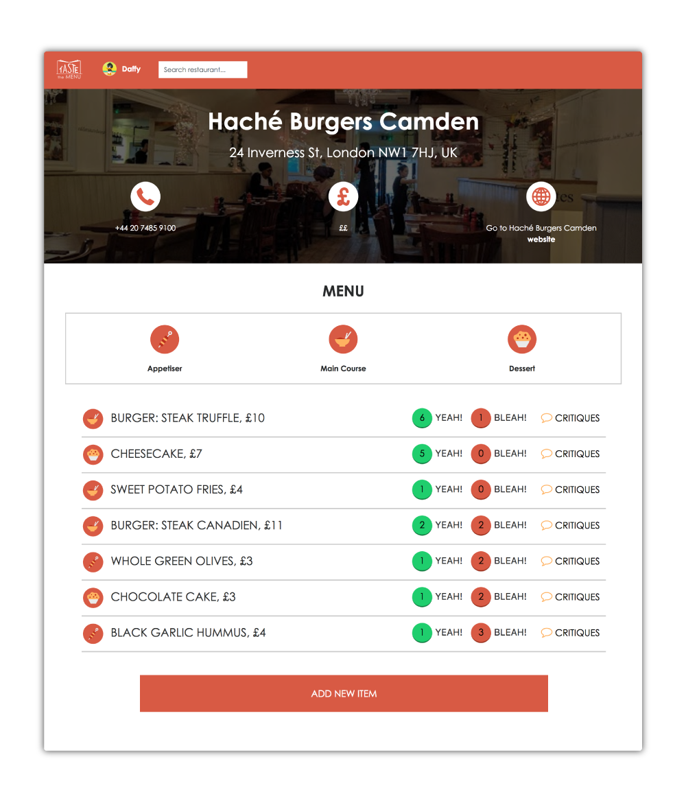
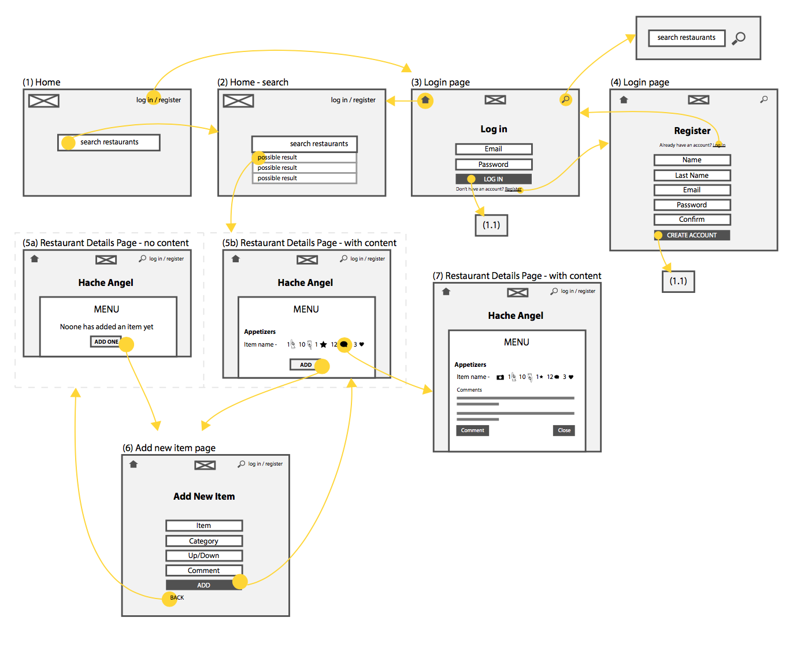
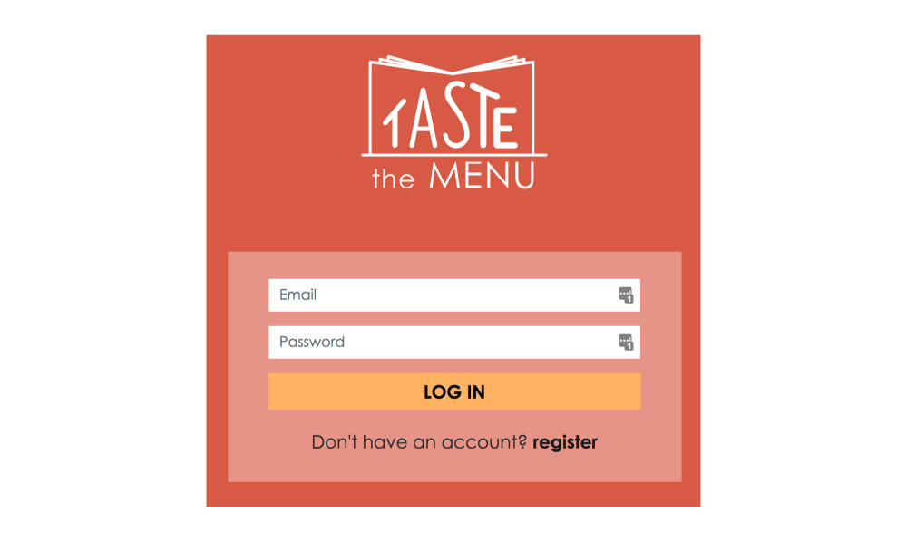

# TASTE the menu 
###WDI Project # 2 - A RESTful full stack app


Visit [TASTE the menu](https://polar-tor-29874.herokuapp.com/) website

---

##About
**TASTE the menu** is a response to the ongoing problem of "order-insecurity". Order-insecurity describes the state anxiety that some people feel when they go out to a restaurant and not ordering the best dishes on the menu. 

The website is meant to be a place where people can help each other eat better meals by voting and critiquing on things they tried from restaurants around the UK.

This is an Express app, build using Node.js, Mongo Database, JavaScript and jQuery library, Google Places API, SaSS, Bootstrap CSS framework and Font Awesome icons. 

<br>
---



---
<br>
##Process
I started by putting together a problem and solution statement as well as an outline of what my ideal MVP would be. 

In the MVP, the user would be able to 

- Log into the website or create a new account;
- Search for the restaurant they tried or that they are going to, 
- Add, vote and critique on items on the menu that they tried or check out what other people say about them
- View and edit their profiles.


=======

- **Day 1**: the whole first day was dedicated to planning. I started thinking about what the MVP should consist of, user journey, requirements and schema structure for my models.



- **DAY 2**: during the second day of the project, I started reading the Google Places API documentation and proceeded with starting to work on the coding a little bit: I worked on authentication, sessions, registrations and the homepage. 



- **Day 3 & 4**: two full days of setting up the rest of the routes, and getting the logic in place for upvotes, downvotes and comments on single menu items. Once the functionality was finished, I worked on the logo, font and general styling of the website.
- **Day 5**: On the last day of our project, I worked on styling and user experience. For example, when the user moves away from the homepage, a search bar gets added to the main nav; or if the user searches for an establishment which is not a restaurant, the menu is hidden and a message appears in its place.
<br>

##Challenges and learnings
This project was extremely formative and challenging on all aspects: 

- Manage a big amount of files and lear to move around them with comfort.
- The upvote and downvote feature of the website was the most challenging one, but definited the most satisfying to tackle.

This function describes the system in which a single user can up or down vote only once for each option and they can toggle between them.

The users are tracked by pushing their IDs to an array inside the menu item schema, a referenced document to the restaurant schema.

```
function menuItemsUpdate(req, res) {
  Restaurant
  .findById(req.params.restaurantId)
  .exec()
  .then((restaurant) => {
    if(!restaurant) return res.status(404).render('statics/404');

    var menuItem = restaurant.menuItem.find(obj => obj._id == req.body.id);
    let hasVotedUpvote = menuItem.upvoteHistory.includes(req.session.userId.toString())
    let hasVotedDownvote = menuItem.downvoteHistory.includes(req.session.userId.toString())

    if(req.body.upvotes){
      if(!menuItem.upvoteHistory.includes(req.session.userId.toString())){        menuItem.upvoteHistory.push(req.session.userId);
        menuItem.upvotes += 1;
        if(hasVotedDownvote){
          menuItem.downvotes -= 1;
          checkIfinArrayandSplice(req.session.userId, menuItem.downvoteHistory);
        }
      }
    } else if(req.body.downvotes){ 
      if(!menuItem.downvoteHistory.includes(req.session.userId.toString())){         menuItem.downvoteHistory.push(req.session.userId);
        menuItem.downvotes += 1;
        if(hasVotedUpvote){
          menuItem.upvotes -= 1;
          checkIfinArrayandSplice(req.session.userId, menuItem.upvoteHistory);
        }
      }
    }
    restaurant.save();
  });
}
```

- Another challenge was trying to focus on the user experience, even in such a short period of time. This really gave me a better idea on all the possible scenarios that we as developers have to take into account even if the website doesn't have too many pages.
- The use of APIs was also a brand new concept for me, but it was fun using it and learning how to make the frontend side communicate with the serverside.

```
var newVenue = { name: place.name, restaurantId: place.place_id, websiteURL: place.website, types: place.types, priceLevel: place.price_level, rating: place.rating, address: place.formatted_address, phoneNumber: place.international_phone_number, photo: place.photos[0].getUrl({'maxWidth': 1920, 'maxHeight': 500})};
    $.ajax({
      url: '/restaurants/new',
      method: 'POST',
      data: newVenue,
      success: function(data){
        location.href = `${location.origin}/restaurants/${data.restaurantId}`;
      }
    });
```
 

##Future plans

- Adding the possibility to add the menu to favorites, and display them in a user's profile;
- Work more on the design and user experience - test out different layouts as well as the user journey itself;
- Divide the menu by categories (starters / main course / dessert)


**Thanks for watching!!**


